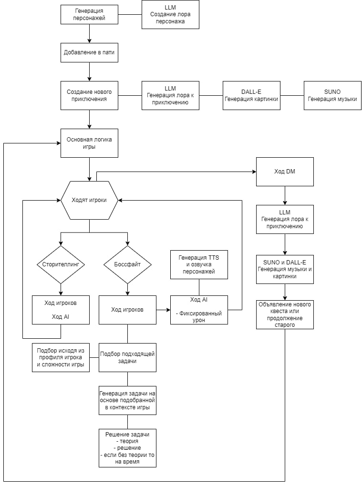
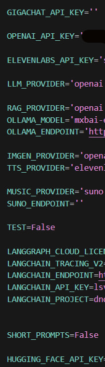
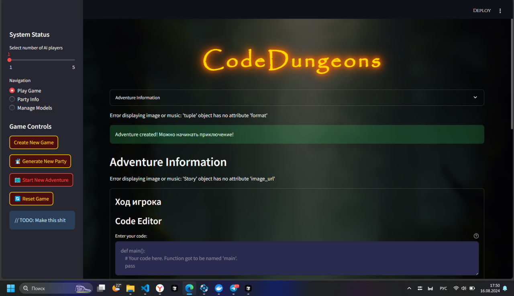
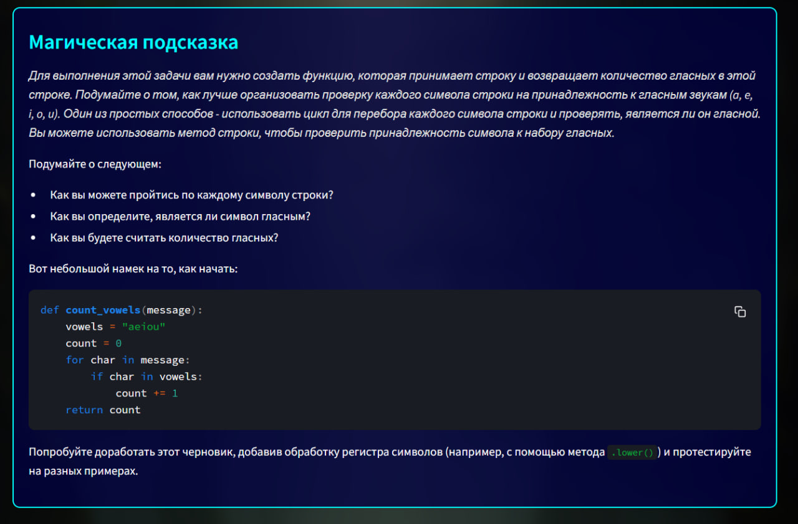
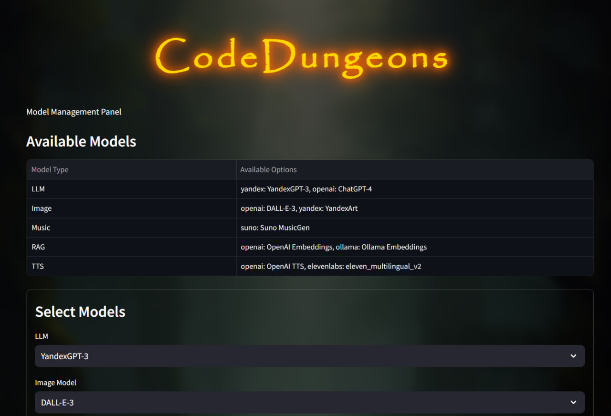

# Готовы к приключению в Code Dungeons?

Попробуйте прямо сейчас!

🎮 [Стабильный сервер](http://51.250.45.249:8502)
🧪 [Тестовый сервер](http://31.128.44.189:8501)

## Краткая инструкция:

1. Создайте игру
2. Соберите команду
3. Начните новое приключение
4. Играйте и наслаждайтесь!

Погрузитесь в мир, где код и фэнтези сливаются воедино. Удачи в подземельях!

# Code Dungeons

## Эпическое описание

Добро пожаловать в **Code Dungeons** — захватывающее приключение, где миры программирования и фэнтези переплетаются! Исследуйте подземелья, полные загадок и кода, сражайтесь с ИИ-противниками и разгадывайте алгоритмы. 

Соберите команду из людей и ИИ-игроков, чтобы преодолеть испытания. Используйте навыки программирования для решения головоломок и победы над врагами. В Code Dungeons каждый квест — это возможность для творчества и инноваций.

Приготовьтесь к приключению, которое изменит ваше представление о мире игр и программирования!

## Реализация на Docker

В проекте появилась реализация на Docker. Для работы с проектом вам понадобятся следующие файлы:

- `Dockerfile`: Определяет образ для приложения.
- `docker-compose.yaml`: Упрощает запуск приложения с необходимыми сервисами.

### Установка и запуск с помощью Docker

1. Убедитесь, что у вас установлен Docker и Docker Compose.
2. Откройте терминал и перейдите в корневую папку проекта.
3. Запустите команду для сборки и запуска контейнеров:
   ```bash
   docker-compose up --build
   ```
4. Откройте браузер и перейдите по адресу `http://localhost:8501`.

Теперь вы можете взаимодействовать с веб-интерфейсом через Docker.

* Очень долгая сборка, так как нужно скачать и установить все зависимости!

### Будущие планы

Пока что не внедрили автозапуск API на FastAPI вместе с игрой. Предполагается докеризация API немного позже.

## Веб-интерфейс

В проекте появился веб-интерфейс на основе Streamlit, который позволяет пользователям взаимодействовать с игрой через браузер. Файл интерфейса находится в корневой папке и называется `main.py`.

### Установка и запуск веб-интерфейса

Для установки виртуального окружения и необходимых зависимостей, а также запуска веб-интерфейса выполните следующие шаги:

1. Убедитесь, что у вас установлен Python (рекомендуется версия 3.7 и выше).
2. Откройте терминал и перейдите в корневую папку проекта.
3. Создайте виртуальное окружение с помощью команды:
   ```bash
   python -m venv venv
   ```
4. Активируйте виртуальное окружение:
   - На Windows:
     ```bash
     venv\Scripts\activate
     ```
   - На macOS и Linux:
     ```bash
     source venv/bin/activate
     ```
5. Установите необходимые зависимости из файла `requirements.txt`:

   обратите внимание, что в файле `requirements.txt` есть некоторые библиотеки, которые не всегда устанавливаются корректно, поэтому рекомендуется устанавливать их вручную: к примеру через windows powershell (админ права требуются).

   ```bash
   pip install -r requirements.txt
   ```
6. Запустите веб-интерфейс:
   ```bash
   streamlit run main.py
   ```
7. Откройте браузер и перейдите по адресу `http://localhost:8501`.

Теперь вы готовы взаимодействовать с веб-интерфейсом.

## Игровой процесс



Диаграмма игрового процесса иллюстрирует основной цикл приключения D&D, показывая, как игроки взаимодействуют с ИИ-Мастером Подземелий и как генерируются и управляются различные игровые элементы.

## Методы API

[Посмотреть полное описание методов API](services/controle_game_api/README.md)

1. **create_game** - Создает новую игру, принимая количество AI и игроков, и возвращает UUID админа для управления игрой.
2. **delete_game** - Удаляет текущую игру, проверяя переданный UUID админа.
3. **add_player** - Добавляет игрока в игру, проверяя, можно ли это сделать, и генерирует персонажа, если требуется.
4. **create_adventure** - Создает новое приключение в текущей игре, используя параметры, такие как создание изображения и музыки.
5. **get_game_state** - Возвращает текущее состояние игры, включая информацию о игроках и последнем ходе.
6. **get_turn_params** - Получает параметры для хода игрока, включая случайно выбранную задачу.
7. **make_turn_player** - Обрабатывает ход игрока, проверяя его действия и обновляя состояние игры.
8. **make_turn_ai** - Обрабатывает ход AI игрока, обновляя состояние игры.
9. **get_all_tasks** - Возвращает все задачи, доступные в текущей игре и пользовательские задачи.
10. **get_task** - Получает конкретную задачу по UUID.
11. **generate_task** - Генерирует новую пользовательскую задачу.
12. **execute_task** - Выполняет задачу, проверяя код на соответствие условиям задачи.
13. **get_hint** - Получает подсказку для конкретной задачи.
14. **explain_solution** - Объясняет решение для конкретной задачи.
15. **get_voices** - Возвращает доступные голоса для TTS.
16. **make_tts_ai** - Создает TTS для AI игрока, используя текст текущего хода.
17. **make_turn_dm** - Обрабатывает ход DM, обновляя состояние игры.
18. **make_image** - Генерирует изображение для сцены на основе описания.
19. **make_music** - Генерирует музыку для сцены на основе описания.

## Особенности

- Масштабируемая архитектура, позволяющая без усилий расширять функц��онал и добавлять новые возможности
- Гибкость в изменении промптов, что позволяет адаптировать игру под любые сценарии и предпочтения игроков
- Поддержка создания разнообразных интерфейсов, включая TGbot и веб-приложения, для удобного взаимодействия с пользователями
- Обширный выбор моделей и простая интеграция через `source/models/init_models.py`, что делает процесс настройки интуитивно понятным
- Возможность кастомизации игровых механик и правил, создавая уникальный и запоминающийся игровой опыт для каждого игрока
- Интуитивно понятный API, который упрощает разработку и интеграцию новых функций, позволяя разработчикам сосредоточиться на креативности и инновациях



## Структура кода

Основная логика игры распределена по нескольким Python-файлам:

- `game_setup.py`: Обрабатывает инициализацию игры и создание персонажей
- `game_run.py`: Управляет основным игровым циклом и выполнением ходов
- `game_quest.py`: Реализует различные типы квестов и генерацию испытаний
- `game_sounds.py`: Управляет воспроизведением аудио и распознаванием речи

## Авторы

- Борисов Никита
- Рябочкин Алексей

Этот проект был разработан для хакатона AI.ARROW.

## Скриншоты интерфейса






